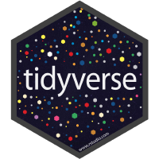

```{r setup, include=FALSE}
knitr::opts_chunk$set(
  results = 'asis',
  echo = FALSE,
  warning = FALSE,
  message = FALSE,
  fig.align = 'center'
)

#Load libraries
library(tidyverse)
library(gapminder)
library(kableExtra)
```

<style>
body {
text-align: justify}
</style>

# Introduction

Hi, I'm Yuzi, a phD student in the cereal quality group of Agriculture & food. Without any programming experience before, the data school is sort of a whole new world for me, and it turned out to be very intereting and I'm keen to learn more.

# My Project

The project is about modelling the degradation of wheat starch. Hundreds of starches from the MAGIC (Multiparent advanced generation intercross) population are being used for measuring the degradability and also some other structural properties. The end goal is to built a model that predict the degradability of wheat starch from the structural properties.   

## Preliminary results

The current dataset is a combination of my experimental results (hydrolysis) on morn than 200 wheat starch with some previous results from other people regarding to the structural properties. The hydrolysis assay was done in microplates, it's an enzymatic reaction over 30 hours during which 9 times of sampling was done. 

<br/>

**Tables**
```{r mytable, out.width='60%'}

mydata <- read_csv("data/tidydata/joined_6P_update.csv") %>% 
  select(Sample, ID, Time, Hydro_extent, Amylose_content, D1, D5, D9, mean_Peak, mean_Trough, mean_Final, low_dp, medium_dp, high_dp)

knitr::kable(head(mydata, n = 5), format = "html", align = 'c', caption = "Structural and functional properties of wheat starch") %>% 
  kable_styling("striped", font_size = 10)
```

<style> 
.column-left{float: left; width: 50%; text-align: left;}
.column-right{float: right;width: 50%;text-align: right}
</style>


<div class="column-left">

&nbsp;

# My Digital Toolbox

- Tidyverse (dplyr, ggplot2...)
- Knitr

{width=80px}
{width=70px}

&nbsp;

## Favourite tool 

- ggplot2
- can't wait to learn Shiny

&nbsp; {width=70px}
{width=70px}

</div>

<div class="column-right" style='text-align: justify'> 

```{r heatmap-plot, out.width='100%', fig.align='center', fig.height= 4, fig.width=4, fig.dpi = 300, fig.cap="Spatial variability across the plates"}


# import the dataset

data_6P <- read_csv("data/tidydata/data_6P_cal_3nd.csv")

# select the colmuns needed

data_selected <- data_6P %>% 
  filter(Sample != "C+" & Sample != "C-") %>%  # remove the control samples 
  select(Plate, Row, Col, Time, HE) %>% 
  rename(Column = Col) %>%
  filter(Time == 0 | Time == 120 | Time == 240 | Time == 360 | Time == 1440 |Time == 1800) %>% 
  mutate_each(funs(replace(., .<0, 0))) # replace the negtive values by 0


# plot at time 1800min

### filter the time points

data_t0 <- data_selected %>% 
  filter(Time == 360) %>% 
  filter(!(Column == 7 & Row == "F" & Plate == 6)) %>% # remove an "outlier"
  filter(!(Column == 1 & Row == "F" & Plate == 1)) %>% # remove an "outlier"
  filter(!(Column == 9 & Row == "H" & Plate == 6)) # remove an "outlier"

### plotting

data_t0 %>% 
  ggplot(aes(x = Column, y = Row, fill = HE)) + 
  scale_fill_continuous(name = "Hydrolysis extent", type = "viridis") +
  scale_x_continuous(breaks = c(1, 3, 5, 7, 9, 11)) +
  theme(axis.ticks = element_blank(),
        axis.text = element_text(color = "black"),
        panel.grid = element_blank(),
        panel.background = element_blank(),
        legend.position = "bottom",
        legend.key.size = unit(0.15, "cm"),
        legend.key.width = unit(0.8, "cm"),
        legend.title.align = 0.5,
        legend.text = element_text(size = 7),
        legend.title = element_text(size = 9),
        axis.text.x = element_text(color="black", size=7), 
        axis.text.y = element_text(color="black", size=7)) +
  geom_tile(color = "white", size = 0.1) +
  facet_wrap(~Plate) +
  theme(strip.background = element_blank())


```

<br/>

The heatmap is to explore the spatial variability across the plates at different time points, and also to find potential outliers. For example the figure above shows the hydrolysis extent of the first six plates at 360 minutes. The white blocks are the empty samples, missing  values and very few outliers. As we can see here, the color are randomly distributed, no patterns can be found, which is good. The plate 3 and 6 tend to have higher intensity than the others, whether it's due to the variation of the experimental conditions (temperature, enzymatic activity...) or the difference between samples need to be checked later on.     


</div>

&nbsp;
&nbsp;
&nbsp;
&nbsp;
&nbsp;
&nbsp;


# My time went ...

- tidying the data (the most time-consuming part)
- checking the spatial variability across the plates (heatmap)
- plotting the experimental results (fig.1)
- curve fitting 
- exporting all the estimated parameters from the model
- plotting the fitted values (fig.2)

<style> 
.column-left{float: left; width: 50%; text-align: left;}
.column-right{float: right;width: 50%;text-align: right}
</style>

<div class="column-left">

<br/>
<br/>
<br/>

```{r standard-plot, out.width='100%', fig.align='center', fig.height= 4, fig.width=4, fig.dpi = 300, fig.cap="Experimental results of the starch hydrolysis extent"}


# import the dataset and add a new colume


# this new column will help us do the plot

hydro <- read_csv("data/tidydata/data_6P_cal_3nd.csv")%>% 
  mutate(status = case_when( ## creat a new column to classify three different conditions
    Sample == "C+" ~ "Positive control", ## if the sample name is C+, give it pos_control
    Sample == "C-" ~ "Negative control", ## if the sample name is C-, give it neg_control
    TRUE ~ "Sample" ## if it's not the cases above, give it other
  )) 

# creat a new column to distingrish each sample 

hydro <- hydro %>% 
  mutate(Well = paste(Plate, Row, Col, sep = "_")) 

# remove the outlier at 20min in plate 1

## find the outlier first

find_max <- hydro %>% 
  filter(Time == 20) %>% 
  arrange(desc(HE))

## remove it

hydro_no_outlier <- hydro %>% 
  filter(!(Time == 20 & Well == "1_C_11"))

# plotting the hydrolysis extent overtime

ggplot(data = hydro_no_outlier, aes(x = Time, 
                                    y = HE,
                                    group = Well,
                                    color = status)) +
  geom_point(size = 1, shape = 1) + ## use hollow circles by "shape = 1"
  geom_line(size = 0.05) + # make the line thinner
  scale_color_manual(values = c("#e41a1c", "#4daf4a", "#377eb8")) +
  scale_y_continuous(limits = c(0,100), expand = c(0, 0)) + ## set the range of the y axis with no more expand
  scale_x_continuous(breaks = c(500, 1500),
                     limits = c(0, 1900), expand = c(0, 0)) +
  ylab("Hydrolysis extent (%)") + ## change the label for the y axis
  xlab("Time (min)") + ## change the name of the x axis
theme(legend.title = element_blank(),
      panel.grid = element_blank(),
      axis.line = element_line(colour = "black", size = 0.5),
      panel.background = element_blank(),
      axis.ticks=element_line(colour="black", size=.5)) +
  labs(x = "Time (min)", y = "Hydrolysis extent (%)") +
  theme(axis.text.x = element_text(color="black", size=7), 
        axis.text.y = element_text(color="black", size=7)) +
  
  theme(legend.key = element_blank(),
        legend.position = "bottom") +
  theme(plot.margin = unit(c(5.5,12,5.5,5.5), "pt")) + ## set the margin
  facet_wrap(~ Plate) +
  theme(strip.background = element_blank())
```

</div>

<div class="column-right">

<br/>

```{r fitted-HE-plot, out.width='100%', fig.align='center', fig.height= 4, fig.width = 4, fig.dpi = 300, fig.cap="Fitted results of the starch hydrolysis extent"}

# read in the fitted hydrolysis extent dataset

fitted_HE <- read_csv("analysis/fitted_HE.csv") %>% 
  select(h, k, Xinf, fitted_HE) 

# combine this dataset with the previous dataset


total_data <- bind_cols(hydro, fitted_HE) %>% 
  filter(!(Time == 20 & Well == "1_C_11")) # remember to remove this outlier

# creat another data frame with expanded rows 

selected <- total_data %>% 
  select(status, Well, h, k, Xinf) %>% 
  unique() # remove the repeated rows

# repeat each row 1801 times

expanded <- selected[rep(seq_len(nrow(selected)), each = 1801), ] 

Time <- c(0:1800)

x <- expanded %>% 
  mutate(Time = rep(Time, times = 283)) %>% 
  mutate(fitted_HE = Xinf*(1-exp(-k*Time**(1-h))))

# plotting

  ggplot() +
  geom_point(data = total_data, 
             aes(x = Time,
                 y = HE,
                 group = Well,
                 color = status),
             size = 1, shape = 1) + ## use hollow circles by "shape = 1"
     
 # make the line thinner
  scale_color_manual(values = c("#e41a1c", "#4daf4a", "#377eb8")) +
  scale_y_continuous(limits = c(0,100), expand = c(0, 0)) + ## set the range of the y axis with no more expand
  scale_x_continuous(breaks = c(500, 1500),
                     limits = c(0, 1900), expand = c(0, 0)) +
  ylab("Hydrolysis extent (%)") + ## change the label for the y axis
  xlab("Time (min)") + ## change the name of the x axis
theme(legend.title = element_blank(),
      panel.grid = element_blank(),
      axis.line = element_line(colour = "black", size = 0.5),
      panel.background = element_blank(),
      axis.ticks=element_line(colour="black", size=.5)) +
  labs(x = "Time (min)", y = "Hydrolysis extent (%)") +
  theme(axis.text.x = element_text(color="black", size=7), 
        axis.text.y = element_text(color="black", size=7)) +
  
  theme(legend.key = element_blank(),
        legend.position = "bottom") +
  theme(plot.margin = unit(c(5.5,12,5.5,5.5), "pt")) + ## set the margin
  facet_wrap(~ Plate) +
  theme(strip.background = element_blank())


```


</div>

&nbsp;
&nbsp;
&nbsp;
&nbsp;
&nbsp;
&nbsp;

# Next steps

- Try other mathematical equations to do the curve fitting, compare the goodness of fitting among them
- Establishing a predictive model using the Partial least squares (PLS) regression

&nbsp;
&nbsp;
&nbsp;
&nbsp;
&nbsp;
&nbsp;

# My Data School Experience

It's an awesome learning experience, the nice pace made it easy to follow. I've already applied what I've learnt in data school to my daily work, and it's always exciting to learn and explore more R codes that help us solve various problems. 


